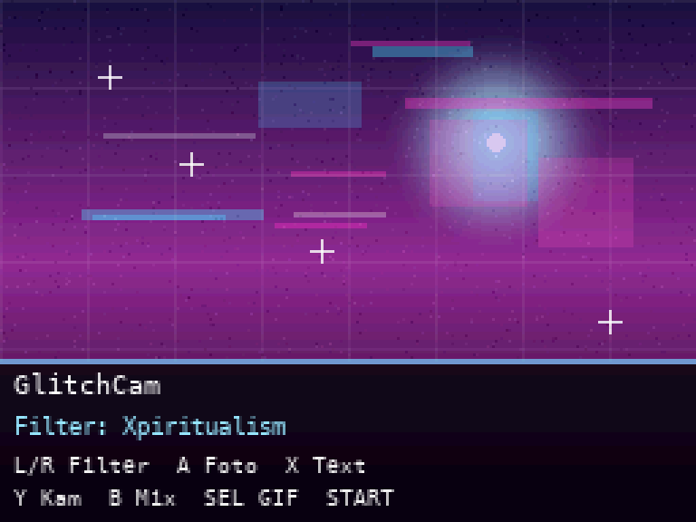

# GlitchCam

A glitch / dreamcore / Y2K **filter camera for the Nintendo DSi**. Apply live filters, overlay floating multi-script text, snap photos, and record animated GIFs — all on real DSi hardware.



## Features

- **5 live filters**: Clean, Xpiritualism, Dreamcore, Jabujin, Y2K — RGB-shift, datamosh blocks, threshold, edge-glow, bloom, ghosting, posterize, grain, scanlines, color grading.
- **Floating text overlays** in Japanese, Chinese, Arabic and Latin (spiritual / dreamcore words), randomly composed over the frame.
- **Photo capture** (PNG) saved to `sd:/DCIM/100DSI00/`.
- **Animated GIF recording** with a small on-device GIF encoder (palette + LZW), saved straight to the SD card.
- **Stylized dual-screen UI**: filtered viewfinder on the top screen, a dreamcore interface with readable controls on the bottom screen.

## Controls

| Button | Action |
|--------|--------|
| L / R  | Previous / next filter |
| A      | Take a photo |
| X      | Toggle text overlay |
| B      | Shuffle the text layout |
| SELECT | Record a short GIF |
| Y      | Swap camera (inner / outer) |
| START  | Exit |

## Install

GlitchCam runs on a **softmodded Nintendo DSi or DSi XL**. It uses the cameras, so it does **not** work on a DS / DS Lite, and it needs homebrew access.

1. If your DSi isn't hacked yet, follow [dsi.cfw.guide](https://dsi.cfw.guide/).
2. Download `GlitchCam.nds` from the [Releases](../../releases) page.
3. Copy it into your `roms/nds/` folder (or anywhere your homebrew launcher can see it).
4. Launch it. Photos and GIFs land in `sd:/DCIM/100DSI00/`.

## Build from source

Requires [devkitPro](https://devkitpro.org/) with the `nds-dev` group installed.

```sh
export DEVKITPRO=/opt/devkitpro DEVKITARM=/opt/devkitpro/devkitARM
make
```

This produces `dsi-camera.nds` (the GlitchCam binary). The image/font assets are pre-generated headers (`subbg.h`, `font.h`, `textstamps.h`) so no extra tooling is needed to build.

## Credits

- Based on [dsi-camera](https://github.com/Epicpkmn11/dsi-camera) by **Epicpkmn11** (public domain) for the DSi camera access and PXI / ARM7 plumbing.
- [lodepng](https://github.com/lvandeve/lodepng) by Lode Vandevenne for PNG encoding.
- Built with [devkitPro](https://devkitpro.org/) / libnds.
- Filters, GIF encoder, text overlays, interface and assets by **MagneticSnake**.

## License

Public domain — released under [The Unlicense](LICENSE), same as the base project. Do whatever you want with it.
